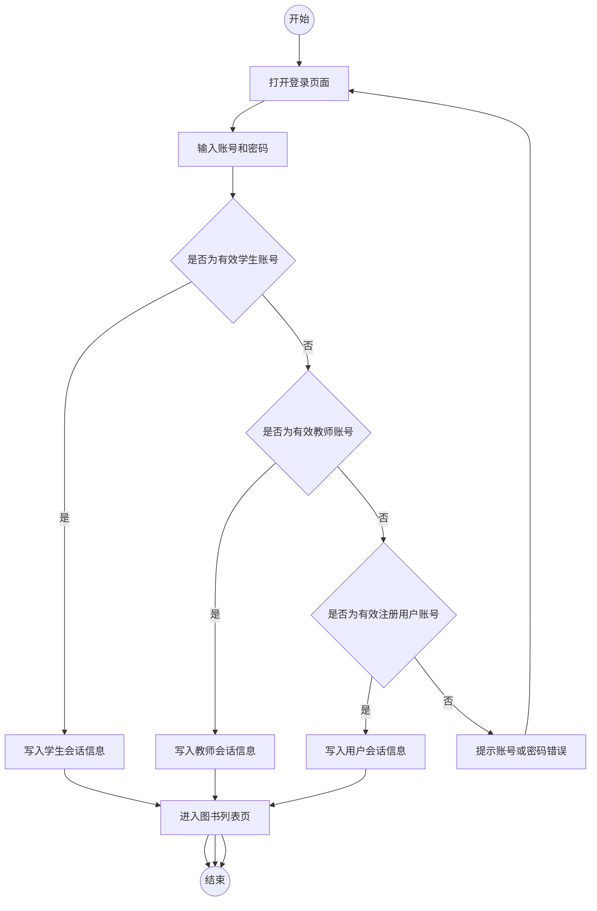
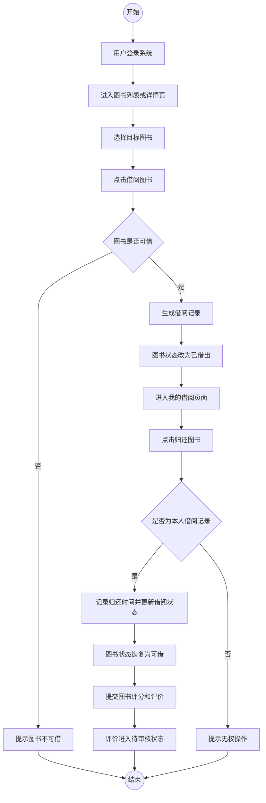
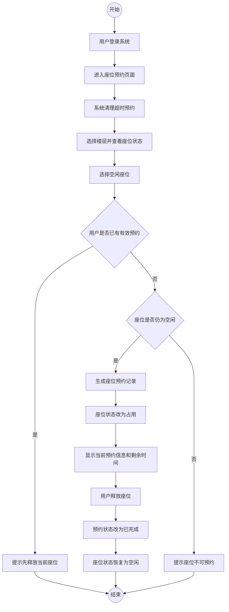
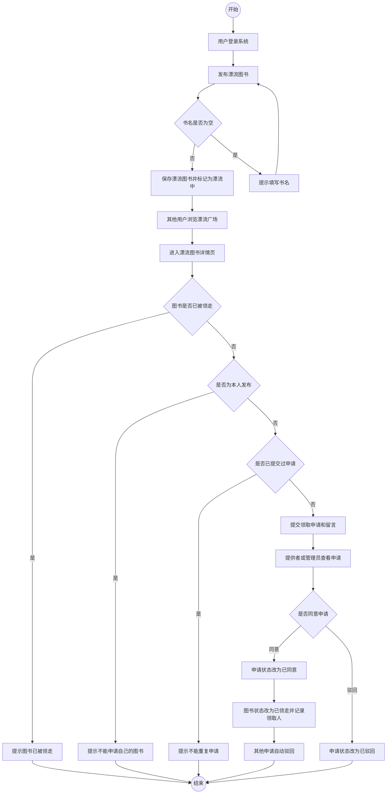
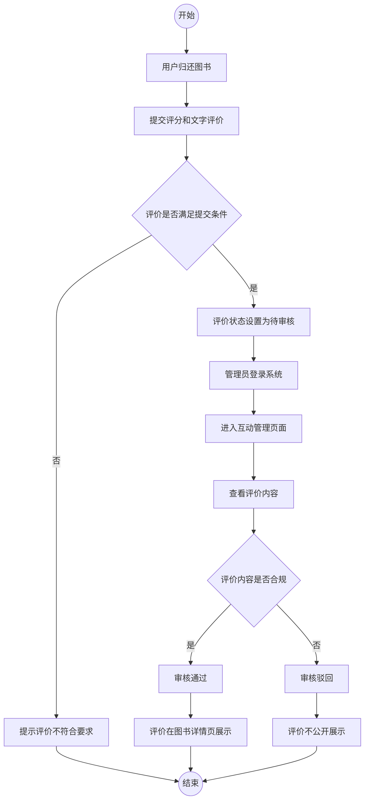
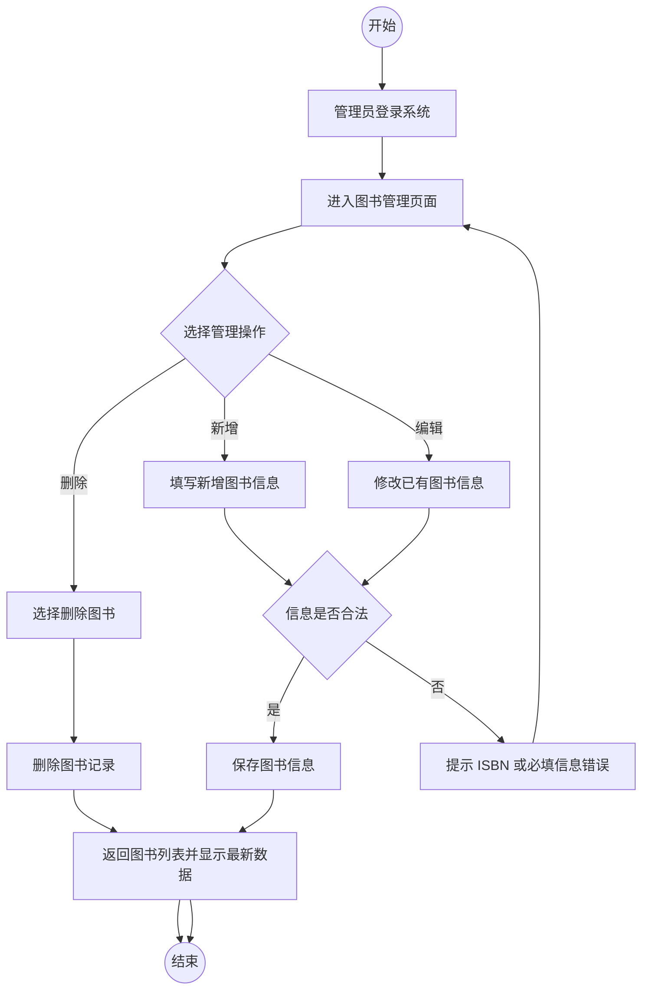
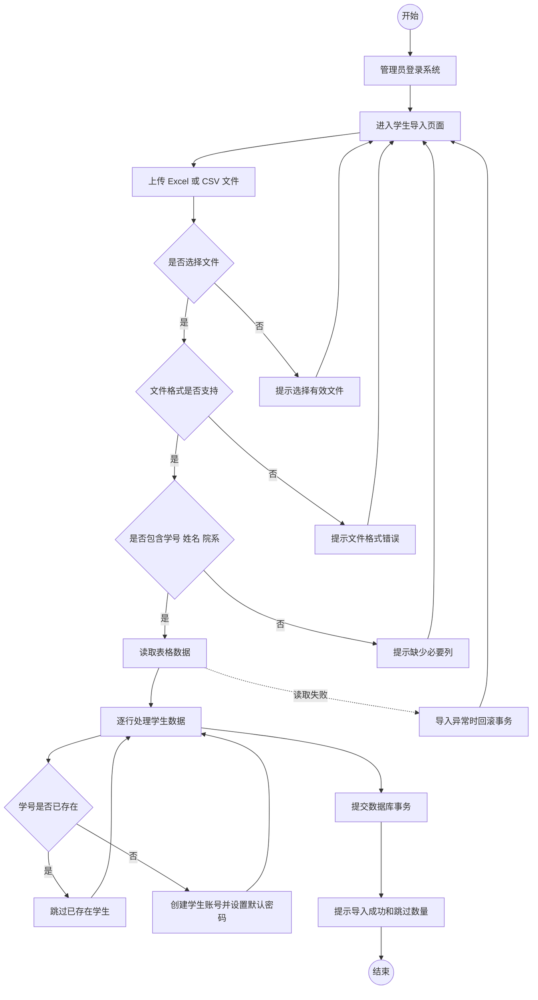
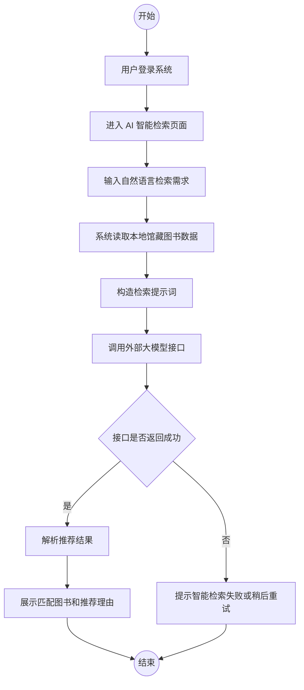

# 智慧图书馆管理系统用例描述与活动图

本文根据“基于 Flask 的智慧图书馆管理系统”的实际功能模块，对系统主要用例进行描述，并给出关键业务流程的 Mermaid 活动图。系统主要面向读者用户和管理员用户两类参与者。其中，读者用户包括普通注册用户、学生用户和教师用户，主要完成图书检索、借阅归还、座位预约、图书漂流、收藏评价和个人信息维护等操作；管理员用户主要完成图书信息维护、用户账号管理、评价审核、漂流图书管理和数据统计查看等操作。

## 1 核心用例描述

| 用例编号 | 用例名称 | 参与者 | 前置条件 | 基本流程 | 异常或备选流程 | 后置条件 |
| --- | --- | --- | --- | --- | --- | --- |
| UC-01 | 登录系统 | 读者用户、管理员 | 用户已拥有有效账号 | 用户输入账号和密码；系统依次按学生、教师、普通注册用户规则验证身份；验证成功后写入会话信息并跳转到图书列表页 | 账号不存在或密码错误时，系统提示登录失败；已登录用户再次访问登录页时直接进入系统 | 系统保存用户 ID、账号类型、用户名、角色和头像等登录状态 |
| UC-02 | 注册普通用户 | 普通注册用户 | 用户未登录，用户名未被占用 | 用户填写用户名、邮箱和密码；系统检查用户名是否重复；创建普通用户账号并保存密码哈希 | 用户名已存在时，提示更换用户名 | 新用户创建成功，可使用用户名和密码登录系统 |
| UC-03 | 检索与查看图书 | 读者用户、管理员 | 用户已登录 | 用户进入图书列表页；输入书名、作者、ISBN 或选择分类；系统返回匹配图书；用户进入详情页查看封面、简介、出版社、馆藏位置、状态、评分和评价 | 未检索到结果时显示空列表或提示信息；未登录访问时跳转登录页 | 用户获得目标图书信息，为借阅、收藏或评价做准备 |
| UC-04 | 借阅图书 | 读者用户 | 用户已登录，目标图书状态为可借 | 用户在图书列表或详情页发起借阅；系统检查图书状态；创建借阅记录；将图书状态改为已借出 | 图书已借出或不可用时提示无法借阅；数据库操作异常时回滚事务 | 借阅记录保存成功，图书状态变为已借出 |
| UC-05 | 归还图书与提交评价 | 读者用户 | 用户已登录，存在本人未归还借阅记录 | 用户进入我的借阅页；点击归还；系统校验记录归属；更新归还时间和记录状态；图书恢复为可借；用户可在详情页提交评分和评价 | 非本人记录禁止操作；未归还图书不能评价；重复评价、评分不合法或评价内容过短时提示错误 | 借阅记录变为已归还；合法评价进入待审核状态 |
| UC-06 | 收藏图书与查看推荐 | 读者用户 | 用户已登录 | 用户在图书详情页收藏或取消收藏图书；系统保存或删除收藏记录；用户进入推荐书单页查看个性化推荐 | 管理员无需收藏图书；用户行为数据不足时，系统根据热门借阅、热门收藏和新书补充推荐 | 用户收藏数据被记录，推荐列表根据借阅和收藏行为更新 |
| UC-07 | 座位预约 | 读者用户 | 用户已登录，当前无有效座位预约 | 用户进入座位页面；系统清理超时预约；用户选择楼层并查看座位状态；选择空闲座位；系统生成预约记录并将座位改为占用 | 用户已有有效预约时提示先释放座位；座位已被占用时提示不可预约；无权限释放他人座位时拒绝操作 | 座位预约记录处于有效状态，座位状态变为占用 |
| UC-08 | 图书漂流 | 读者用户、管理员 | 用户已登录 | 用户发布漂流图书；其他用户浏览并提交领取申请；系统校验是否为本人发布、是否重复申请；提供者或管理员处理申请；同意后图书状态改为已领走 | 不能申请自己发布的图书；不能重复申请；图书已领走时不可申请；无权限用户不能处理申请 | 漂流图书和领取申请状态被更新，领取人信息被记录 |
| UC-09 | 图书信息管理 | 管理员 | 管理员已登录 | 管理员新增、编辑或删除图书；维护 ISBN、书名、作者、出版社、分类、馆藏位置、简介、封面和借阅状态等信息 | 非管理员访问时提示权限不足；ISBN 重复或格式错误时提示修正；删除失败时保持原数据 | 图书基础信息被更新，读者端可查看最新馆藏数据 |
| UC-10 | 用户账号管理与学生导入 | 管理员 | 管理员已登录 | 管理员查看普通用户、学生用户和教师用户；上传 Excel 或 CSV 表格批量导入学生；对用户执行重置密码或删除操作 | 文件为空、格式不支持或缺少必要列时导入失败；重复学号跳过；非管理员访问被拒绝 | 用户数据被维护，学生可使用导入的学号和默认密码登录 |
| UC-11 | 图书评价审核 | 管理员 | 管理员已登录，存在待审核评价 | 管理员进入互动管理页面；查看评价内容；选择审核通过或驳回；系统更新评价状态 | 非管理员无权审核；操作参数异常时不更新状态 | 通过的评价在图书详情页展示，驳回的评价不公开展示 |
| UC-12 | 数据统计与智能工具 | 管理员、读者用户 | 用户已登录，管理员查看统计需具备后台权限 | 管理员查看借阅趋势、分类分布、座位使用情况和系统概况；读者可使用 AI 智能检索获取馆藏推荐 | 非管理员访问管理报告时被拒绝；AI 接口异常时给出失败提示 | 管理员获得运营数据，读者获得辅助检索结果 |

## 2 典型用例详细描述

### 2.1 借阅图书用例描述

| 项目 | 内容 |
| --- | --- |
| 用例名称 | 借阅图书 |
| 主要参与者 | 读者用户，包括普通注册用户、学生用户和教师用户 |
| 前置条件 | 用户已登录系统；目标图书存在且状态为可借 |
| 触发条件 | 用户在图书列表页或图书详情页点击借阅按钮 |
| 基本流程 | 1. 用户进入图书列表或图书详情页。2. 用户选择目标图书并发起借阅。3. 系统读取图书信息并判断当前状态。4. 图书状态为可借时，系统创建借阅记录。5. 系统将图书状态更新为已借出。6. 系统提示借阅成功并返回图书列表页。 |
| 异常流程 | 1. 如果用户未登录，系统跳转到登录页面。2. 如果图书已借出或不可用，系统提示无法借阅。3. 如果数据库保存失败，系统回滚事务并提示借阅失败。 |
| 后置条件 | 系统生成一条状态为借阅中的借阅记录，目标图书状态变为已借出。 |

### 2.2 座位预约用例描述

| 项目 | 内容 |
| --- | --- |
| 用例名称 | 座位预约 |
| 主要参与者 | 读者用户 |
| 前置条件 | 用户已登录系统；当前用户没有有效座位预约 |
| 触发条件 | 用户进入座位预约页面并选择空闲座位 |
| 基本流程 | 1. 用户进入座位预约页面。2. 系统自动清理超过 3 小时的有效预约。3. 用户选择楼层并查看座位状态。4. 用户选择空闲座位。5. 系统检查用户是否已有有效预约。6. 系统检查座位是否仍为空闲。7. 系统创建座位预约记录并将座位状态改为占用。8. 系统提示选座成功。 |
| 异常流程 | 1. 如果用户未登录，系统跳转登录页面。2. 如果用户已有有效预约，系统提示先释放当前座位。3. 如果座位已被占用，系统提示该座位不可预约。4. 如果保存失败，系统回滚事务并提示预约失败。 |
| 后置条件 | 系统生成有效座位预约记录，座位状态变为占用。 |

### 2.3 图书漂流用例描述

| 项目 | 内容 |
| --- | --- |
| 用例名称 | 图书漂流 |
| 主要参与者 | 读者用户、管理员 |
| 前置条件 | 用户已登录系统；漂流图书处于漂流中状态 |
| 触发条件 | 用户发布漂流图书、申请领取漂流图书或处理领取申请 |
| 基本流程 | 1. 用户填写书名、关联课程、新旧程度、交换方式和补充说明。2. 系统保存漂流图书并标记为漂流中。3. 其他用户浏览漂流图书列表并进入详情页。4. 用户提交领取申请和留言。5. 系统检查申请人不是图书提供者，且未重复申请。6. 系统保存领取申请。7. 图书提供者或管理员查看申请列表。8. 提供者或管理员同意申请后，系统将图书状态改为已领走，并记录领取人信息。9. 系统自动拒绝同一本图书的其他申请。 |
| 异常流程 | 1. 如果书名为空，系统提示补全信息。2. 如果用户申请自己发布的图书，系统拒绝申请。3. 如果用户重复申请同一本图书，系统提示等待处理。4. 如果图书已被领走，系统禁止继续申请。5. 如果处理人既不是提供者也不是管理员，系统拒绝操作。 |
| 后置条件 | 漂流图书状态和申请状态被更新，系统保留发布、申请和处理记录。 |

### 2.4 图书评价审核用例描述

| 项目 | 内容 |
| --- | --- |
| 用例名称 | 图书评价审核 |
| 主要参与者 | 管理员 |
| 前置条件 | 管理员已登录系统；系统中存在待审核的图书评价 |
| 触发条件 | 管理员进入互动管理页面并对评价执行审核操作 |
| 基本流程 | 1. 管理员进入互动管理页面。2. 系统展示待审核评价、热门收藏、借阅记录和座位预约记录。3. 管理员查看评价内容。4. 管理员选择审核通过或驳回。5. 系统更新评价状态。6. 系统提示审核结果。 |
| 异常流程 | 1. 非管理员访问时系统提示权限不足。2. 操作参数不合法时，系统不更新评价状态。 |
| 后置条件 | 通过的评价可在图书详情页展示，驳回的评价不公开展示。 |

### 2.5 管理员图书信息管理用例描述

| 项目 | 内容 |
| --- | --- |
| 用例名称 | 图书信息管理 |
| 主要参与者 | 管理员 |
| 前置条件 | 管理员已登录系统 |
| 触发条件 | 管理员新增、编辑或删除图书 |
| 基本流程 | 1. 管理员进入图书管理页面。2. 管理员选择新增图书或编辑已有图书。3. 管理员填写或修改 ISBN、书名、作者、出版社、分类、楼层、区域、书架、简介和封面等信息。4. 系统校验必要字段和 ISBN。5. 系统保存图书信息。6. 管理员返回图书列表查看更新结果。 |
| 异常流程 | 1. 非管理员访问时提示权限不足。2. ISBN 格式不合法或重复时提示修改。3. 上传封面失败时保留原图书信息。 |
| 后置条件 | 图书信息被保存或更新，读者端可查询最新图书数据。 |

## 3 活动图

### 3.1 登录系统活动图

### 3.2 图书借阅与归还活动图

### 3.3 座位预约活动图

### 3.4 图书漂流活动图

### 3.5 图书评价审核活动图

### 3.6 管理员图书信息管理活动图

### 3.7 学生账号批量导入活动图

### 3.8 AI 智能检索活动图

## 4 小结

通过上述用例描述和活动图可以看出，本系统围绕读者服务和后台管理两条主线展开。读者端重点支持图书资源获取、学习空间使用和用户互动；管理端重点支持馆藏数据维护、用户账号管理、内容审核和运营统计。各功能模块之间通过用户、图书、借阅记录、座位预约记录、图书评价、漂流图书和领取申请等数据实体形成联系，能够较完整地覆盖校园智慧图书馆的主要业务场景。
