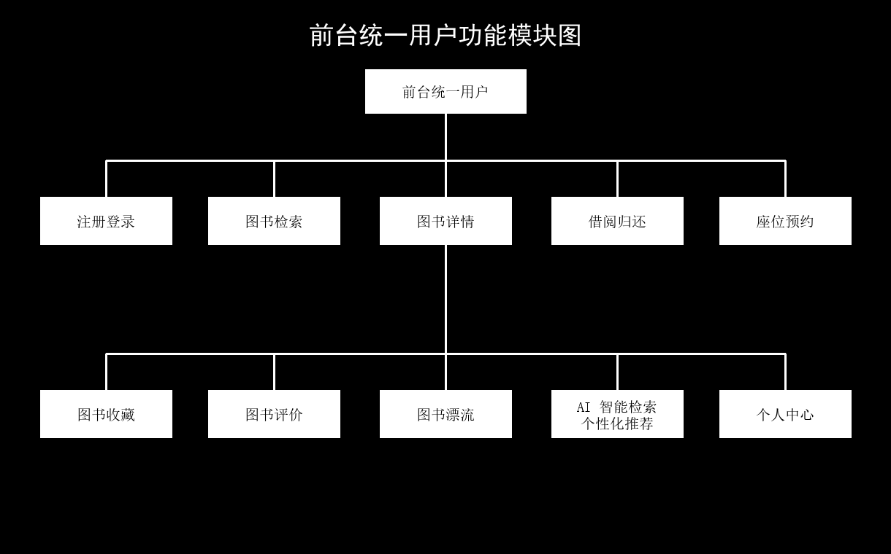
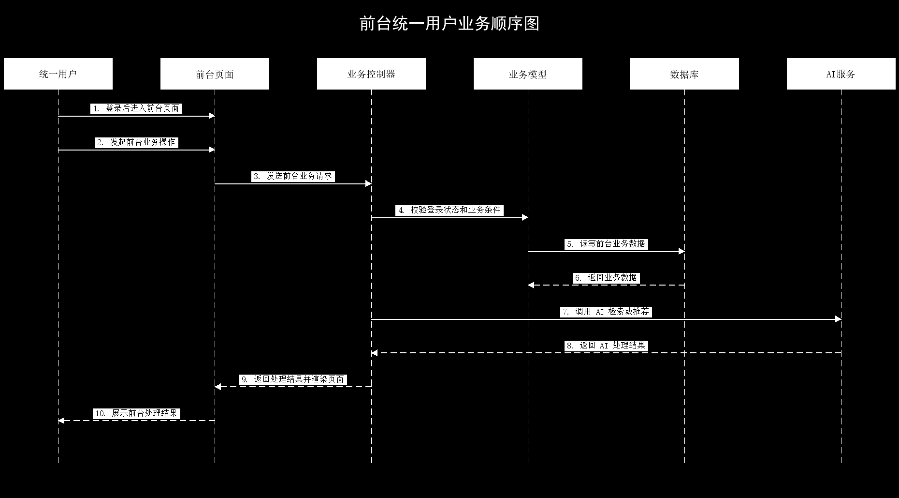
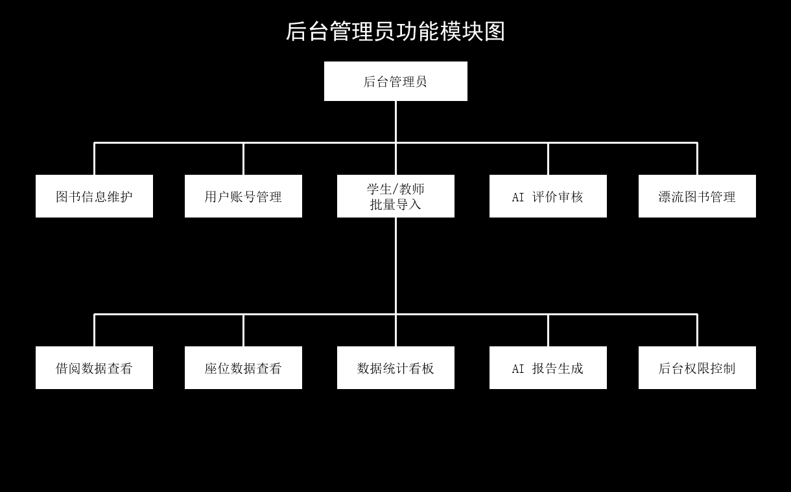
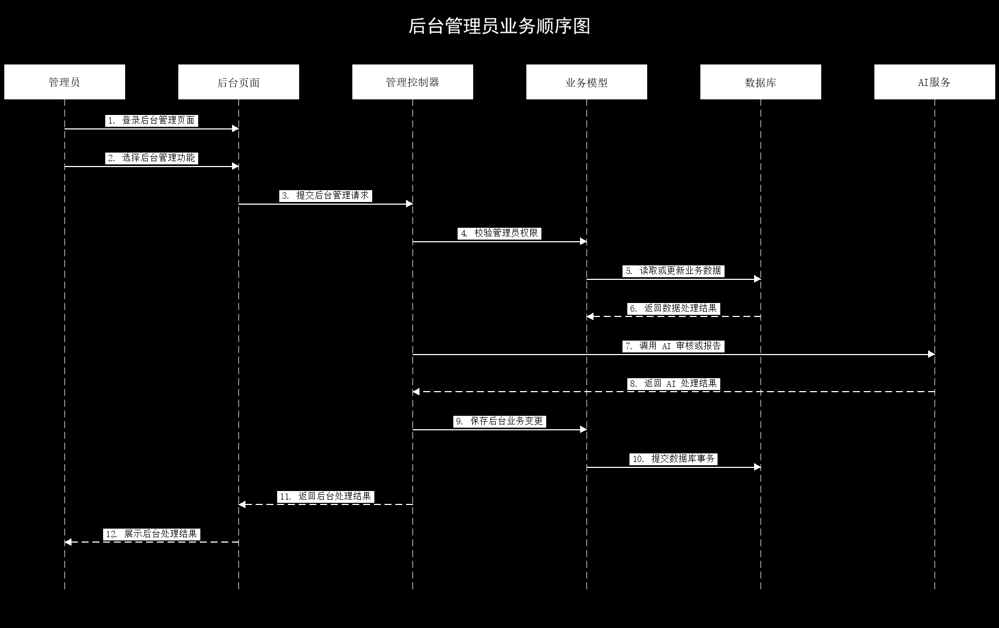

# 前后台方向系统设计说明

## 4.3 前台统一用户功能设计

前台统一用户主要指学生和教师等读者用户。由于学生和教师在系统前台的可用功能基本一致，因此在系统设计中将其抽象为统一用户角色进行描述。统一用户登录系统后，可以进行图书检索、图书详情查看、借阅归还、座位预约、图书收藏、图书评价、图书漂流、AI 智能检索、个性化推荐和个人中心信息查看等操作。前台功能设计强调用户操作的连续性，用户从页面发起请求后，由业务控制器完成登录状态校验和业务条件判断，再通过模型层访问数据库；当业务涉及智能检索或个性化推荐时，系统调用外部 AI 服务辅助生成结果。前台统一用户功能模块如图 4-3 所示，业务处理顺序如图 4-4 所示。

图 4-3 前台统一用户功能模块图

图 4-4 前台统一用户业务顺序图

## 4.4 后台管理员功能设计

后台管理员主要面向系统管理人员，用于维护馆藏资源、用户账号和系统运营数据。管理员登录后台后，可以进行图书信息新增、修改和删除，管理学生、教师和普通用户账号，批量导入学生与教师信息，使用 AI 完成图书评价审核，维护漂流图书信息，查看借阅数据和座位使用数据，并生成数据统计看板和 AI 统计报告。后台功能设计强调权限控制和数据一致性，所有后台请求都需要先校验管理员身份，再根据具体业务访问模型层和数据库；涉及 AI 审核或报告生成时，由控制器组织业务数据并调用 AI 服务，最终将审核状态或报告结果返回后台页面。后台管理员功能模块如图 4-5 所示，业务处理顺序如图 4-6 所示。

图 4-5 后台管理员功能模块图

图 4-6 后台管理员业务顺序图
