# 系统总体设计模块说明

## 4.1 系统功能结构设计

本系统面向校园图书馆日常管理与读者服务场景进行设计，按照使用角色和业务职责划分为读者端功能、管理端功能和系统支撑功能三类。读者端主要完成注册登录、图书检索、图书借阅、座位预约、收藏评价、图书漂流、个性化推荐、AI 智能检索和个人中心等操作；管理端主要完成图书信息维护、用户账号管理、学生与教师批量导入、AI 评价审核、漂流图书管理、借阅与座位数据查看、数据看板与报告等操作；系统支撑功能主要提供权限控制、登录状态保持、数据持久化、文件上传、座位超时释放和外部 AI 服务调用等基础能力。系统功能结构如图 4-1 所示。

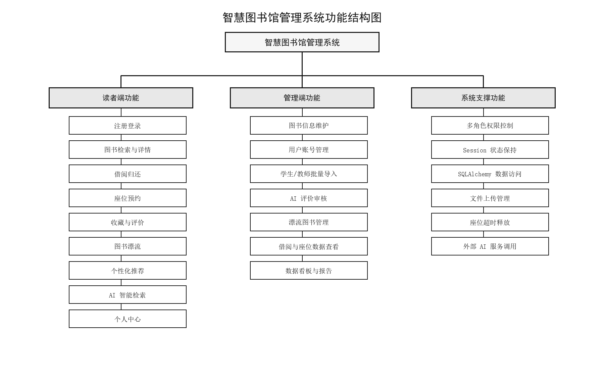

图 4-1 系统功能结构图

## 4.2 系统模块结构设计

系统采用 B/S 架构，后端以 Flask 框架为核心，前端通过 Jinja2 模板、HTML、CSS 和 JavaScript 完成页面展示与交互。按照系统实现层次，可将系统划分为表现层、控制层、业务层、数据访问层和数据存储层。表现层负责接收用户操作并展示处理结果；控制层由 Flask 蓝图路由组成，负责请求分发和页面跳转；业务层承载认证授权、图书管理、借阅归还、座位预约、收藏评价、图书漂流、推荐服务和统计报告等核心逻辑；数据访问层通过 SQLAlchemy ORM 模型完成数据读写；数据存储层使用 MySQL 保存系统业务数据。AI 智能检索、图书评价审核和报告生成等功能通过业务层调用外部 AI 服务完成。系统模块结构如图 4-2 所示。

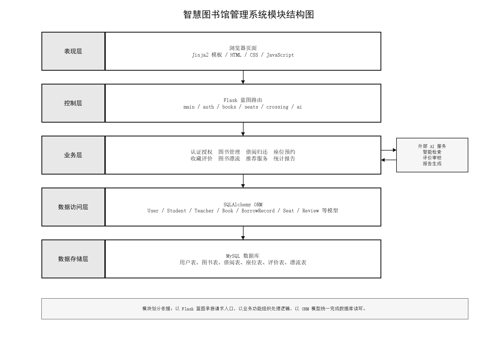

图 4-2 系统模块结构图

## 4.3 主要业务模块与顺序设计

为说明系统主要业务流程，选取用户登录认证、图书借阅、座位预约、图书评价 AI 审核和图书漂流申请五个典型流程进行模块设计与顺序设计。每个业务先给出模块图，用于表示该功能内部的处理节点；随后给出顺序图，用于表示参与对象之间的消息交互过程。登录认证流程体现学生、教师和管理员多类型账号的统一认证方式；图书借阅流程体现图书状态与借阅记录的同步更新；座位预约流程体现座位状态检查、预约记录创建和超时释放机制；图书评价 AI 审核流程体现管理员触发 AI 审核并保存审核结果的过程；图书漂流申请流程体现读者提交领取申请并生成待处理记录的过程。

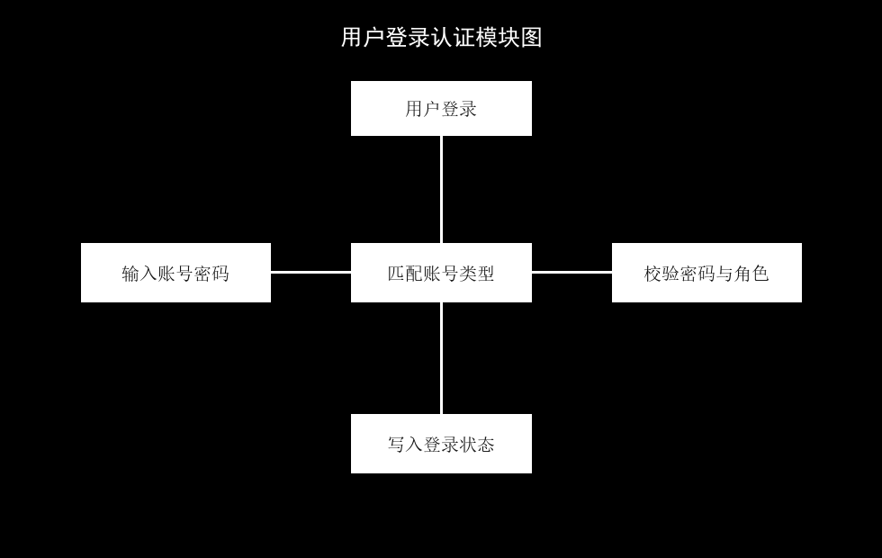

图 4-3 用户登录模块图

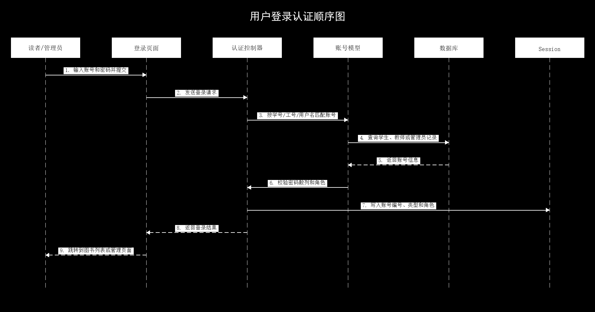

图 4-4 用户登录顺序图

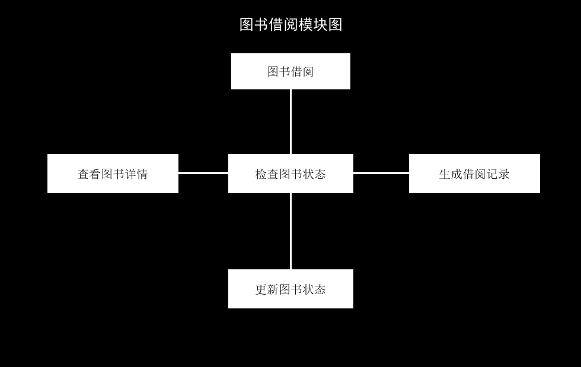

图 4-5 图书借阅模块图

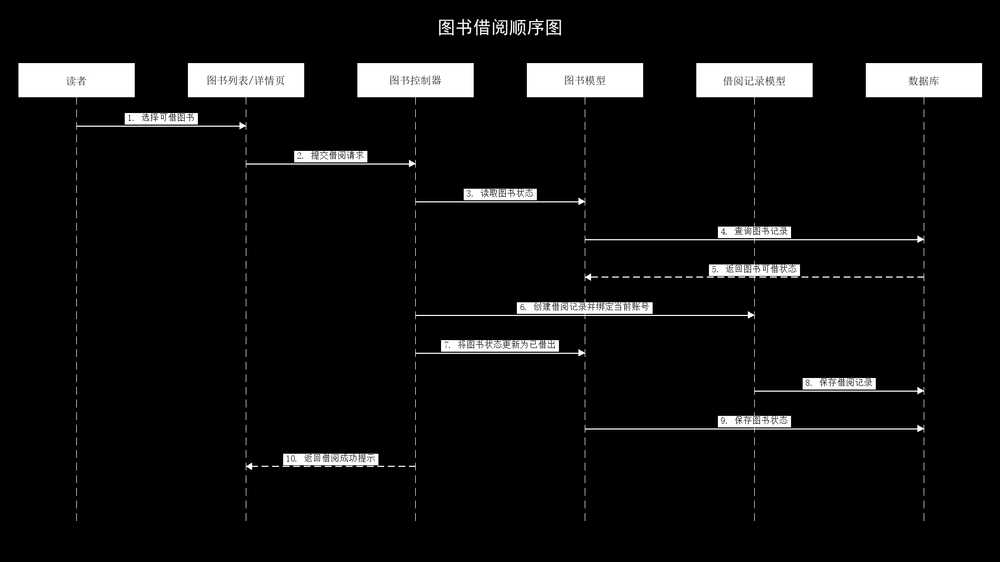

图 4-6 图书借阅顺序图

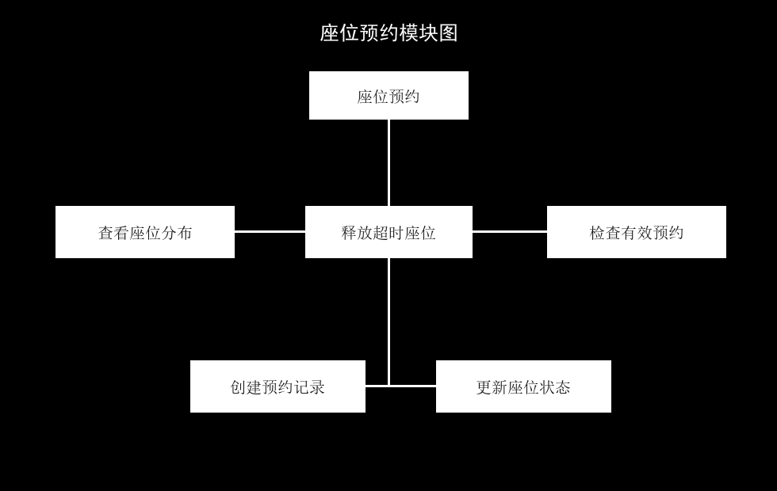

图 4-7 座位预约模块图

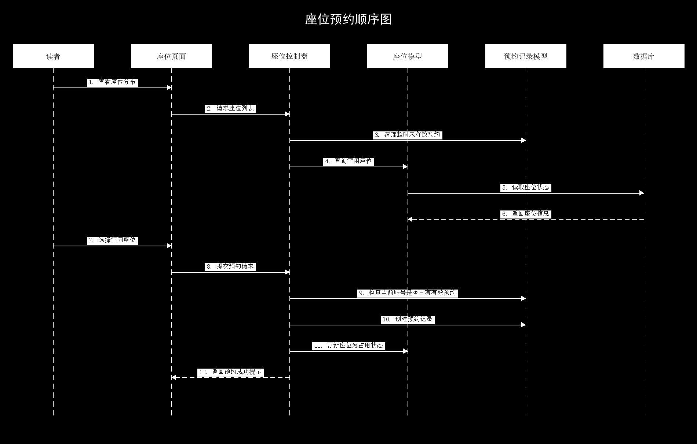

图 4-8 座位预约顺序图

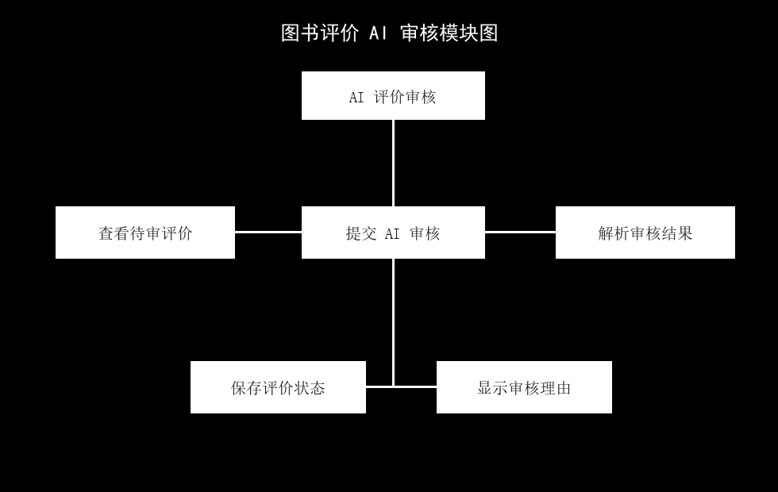

图 4-9 图书评价 AI 审核模块图

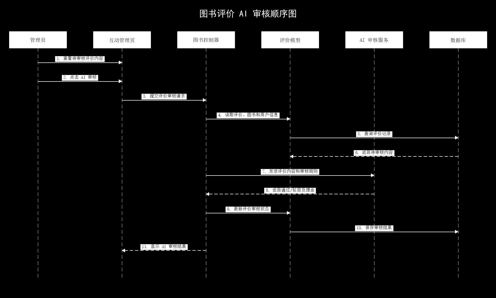

图 4-10 图书评价 AI 审核顺序图

图 4-11 图书漂流申请模块图

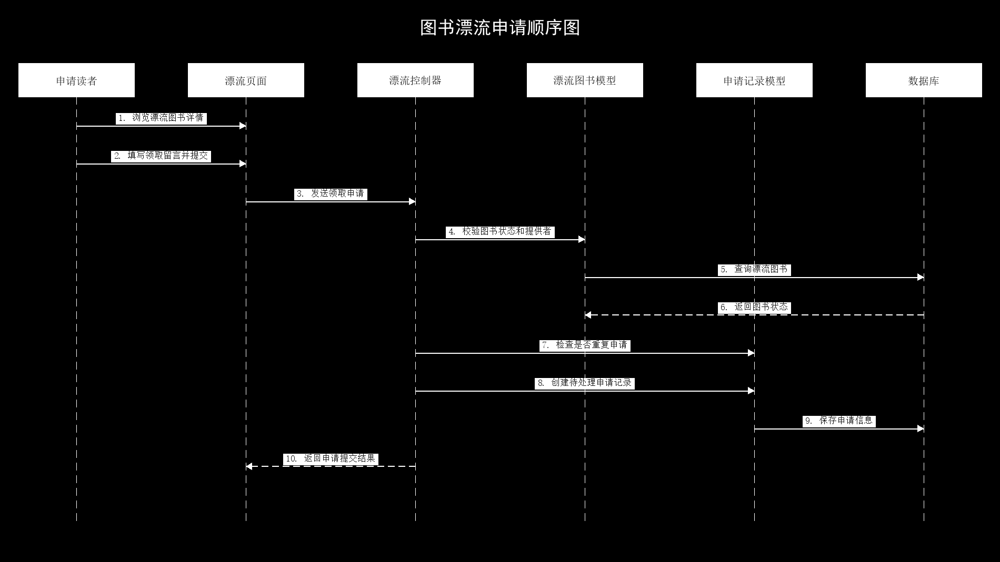

图 4-12 图书漂流申请顺序图
