# 网站功能模块设计说明

本节在前台统一用户和后台管理员两个角色方向的基础上，进一步对系统中的主要功能模块进行细化设计。每个模块均给出功能模块图和顺序图：模块图用于描述模块内部功能点，顺序图用于描述用户在网站页面中的实际操作流程，包括进入页面、填写信息、点击按钮、提交表单和查看处理结果等步骤。

## 4.5 用户认证与个人中心模块

用户认证与个人中心模块负责系统登录入口和用户个人数据展示。系统支持普通注册用户、学生和教师等多类型账号登录，登录时根据账号标识匹配对应用户表，并将账号编号、账号类型和角色信息写入 Session。用户登录后可以修改密码、上传头像，并在个人中心查看借阅记录、收藏记录、评价记录、座位预约和图书漂流相关信息。该模块为其他业务模块提供身份识别和权限判断基础。

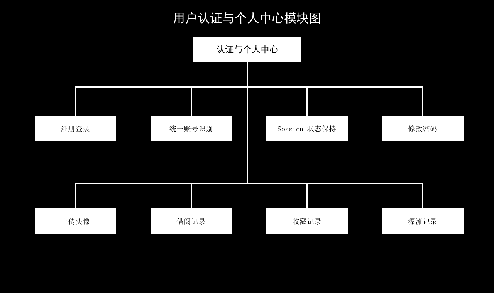

图 4-7 用户认证与个人中心模块图

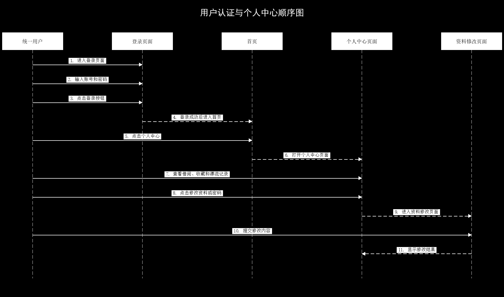

图 4-8 用户认证与个人中心顺序图

## 4.6 图书资源与借阅模块

图书资源与借阅模块是系统的核心业务模块。前台用户可以浏览图书列表，根据书名、作者、分类等条件检索图书，并查看图书详情、封面、简介和馆藏位置。用户借阅图书时，系统需要检查图书是否处于可借状态，生成借阅记录并同步更新图书状态；用户归还图书时，系统更新借阅记录的归还时间，并将图书状态恢复为可借。管理员则可以在后台维护图书基础信息。

图 4-9 图书资源与借阅模块图

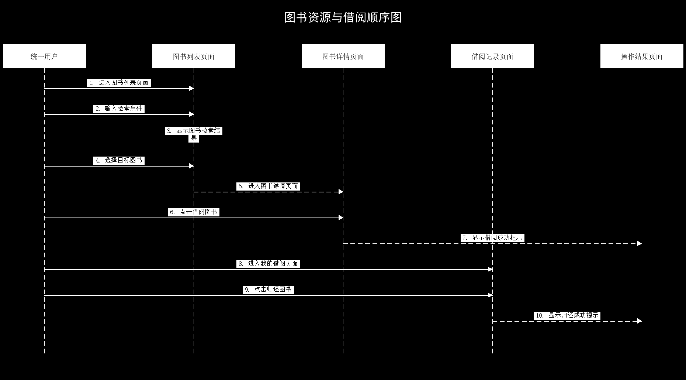

图 4-10 图书资源与借阅顺序图

## 4.7 座位预约模块

座位预约模块用于实现图书馆学习座位的在线查看和预约。用户可以按照楼层、区域和座位状态查看座位分布，选择空闲座位后提交预约请求。系统在创建预约记录前会检查用户是否已有有效预约，避免重复占用座位。用户离座时可以主动释放座位，系统也会对超时未释放的预约记录进行清理，从而保证座位状态与实际使用情况保持一致。

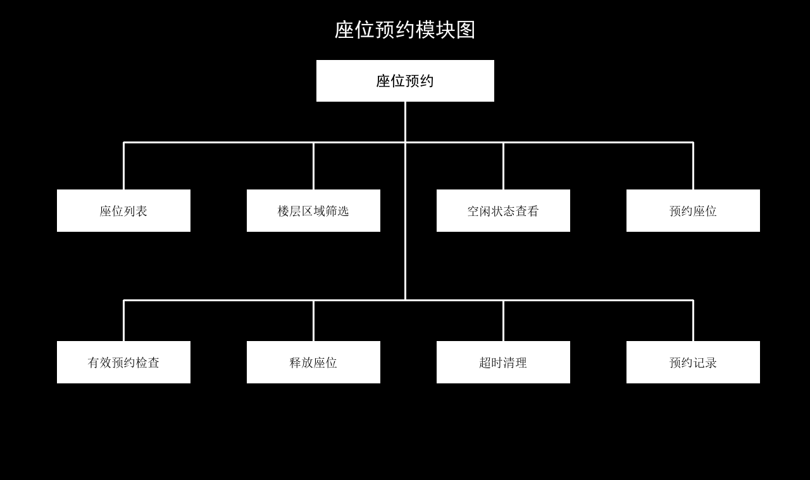

图 4-11 座位预约模块图

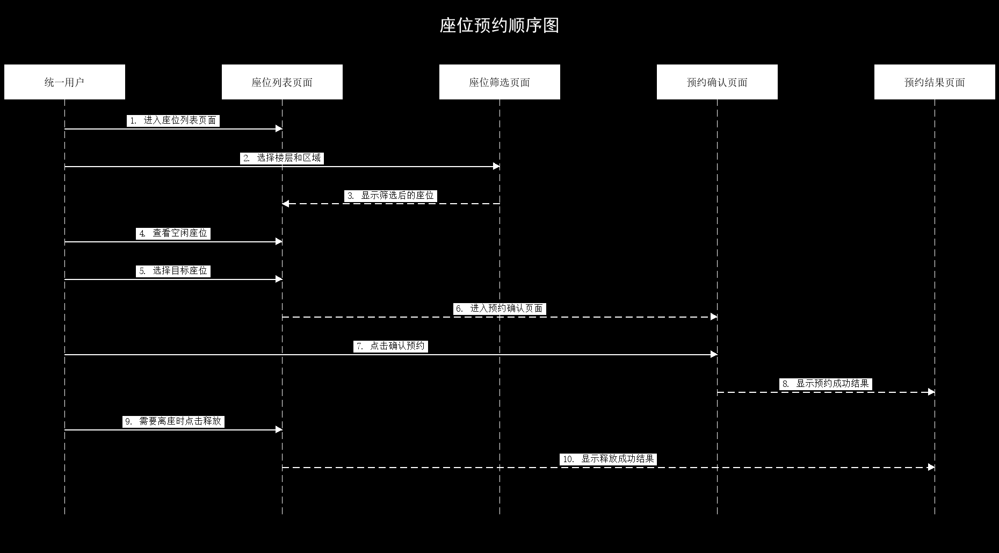

图 4-12 座位预约顺序图

## 4.8 收藏评价与 AI 审核模块

收藏评价与 AI 审核模块用于增强用户与图书资源之间的交互。用户可以收藏感兴趣的图书，也可以在归还图书后提交评价。新提交的评价默认处于待审核状态，管理员在后台查看评价内容后触发 AI 审核，由 AI 根据评价内容和审核规则返回通过或驳回结果，系统再保存评价状态。只有审核通过的评价才会在图书详情页面展示。

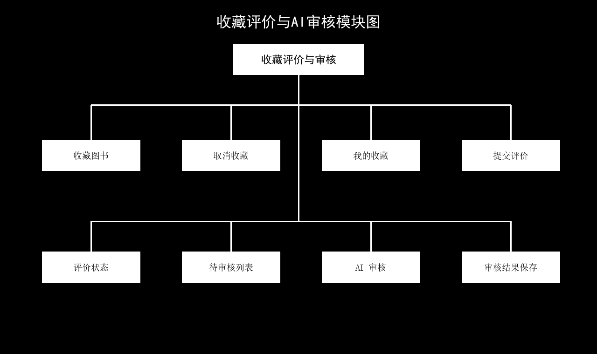

图 4-13 收藏评价与AI审核模块图

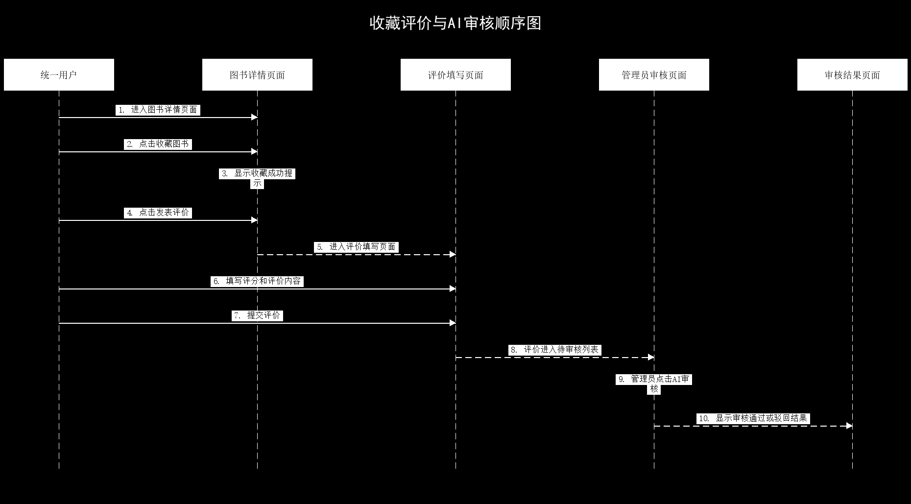

图 4-14 收藏评价与AI审核顺序图

## 4.9 图书漂流模块

图书漂流模块用于支持校园内闲置图书共享。用户可以发布自己的漂流图书，填写书名、关联课程、新旧程度和补充说明等信息。其他用户可以查看漂流图书详情并提交领取申请，系统会检查图书状态、申请人身份和是否重复申请。图书提供者或管理员处理申请后，系统更新申请状态和图书漂流状态，实现图书资源在用户之间流转。

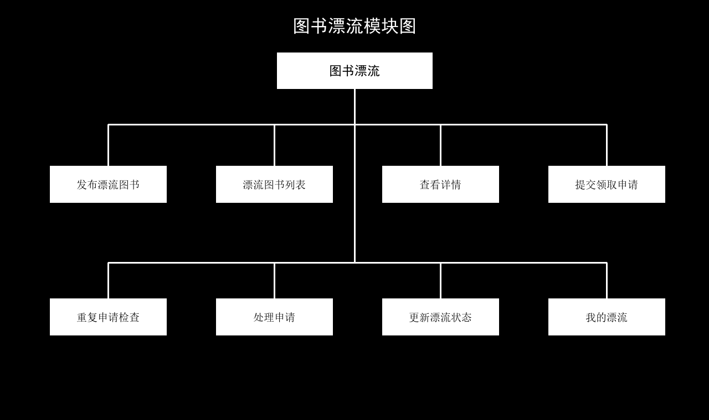

图 4-15 图书漂流模块图

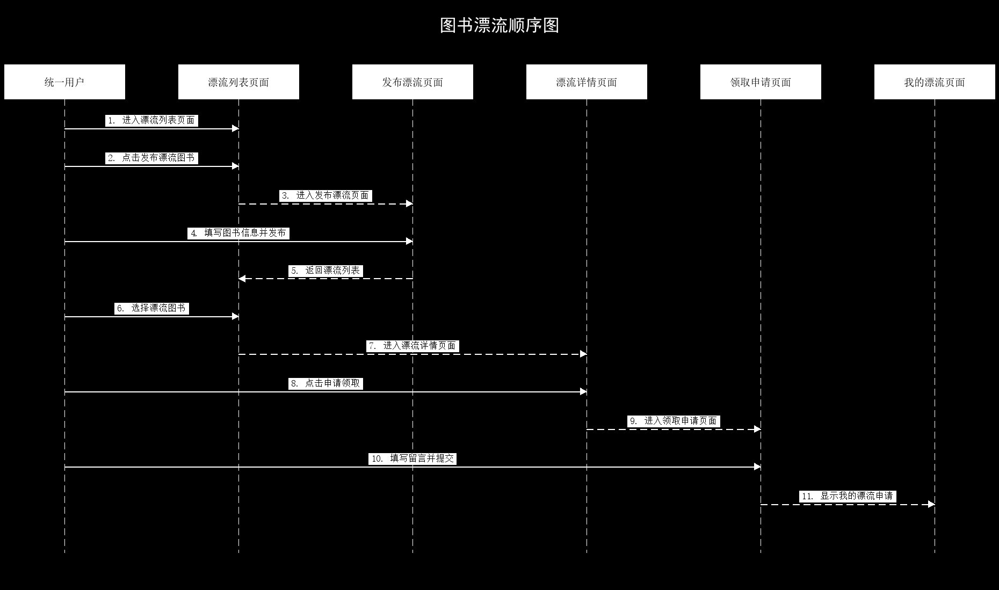

图 4-16 图书漂流顺序图

## 4.10 AI 智能服务模块

AI 智能服务模块用于提升系统的智能化服务能力。系统根据本地馆藏、借阅、收藏、评价和统计数据组织上下文，通过外部 AI 服务完成智能检索、图书匹配、评价审核和统计报告生成。AI 服务不直接操作数据库，而是由系统控制器整理请求数据并接收返回结果，再将结果展示给前台用户或后台管理员。

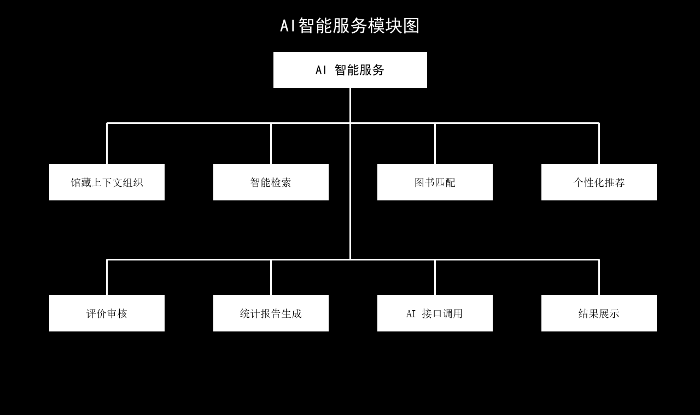

图 4-17 AI智能服务模块图

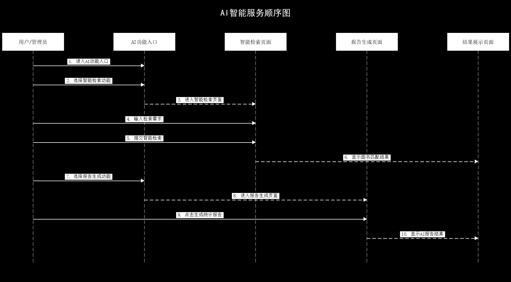

图 4-18 AI智能服务顺序图

## 4.11 后台用户与导入管理模块

后台用户与导入管理模块面向管理员使用，用于维护系统账号数据。管理员可以查看学生、教师和普通注册用户信息，支持批量导入学生和教师账号，并可对异常账号进行重置密码或删除处理。该模块与登录认证模块配合，为系统多类型用户统一登录和权限控制提供数据基础。

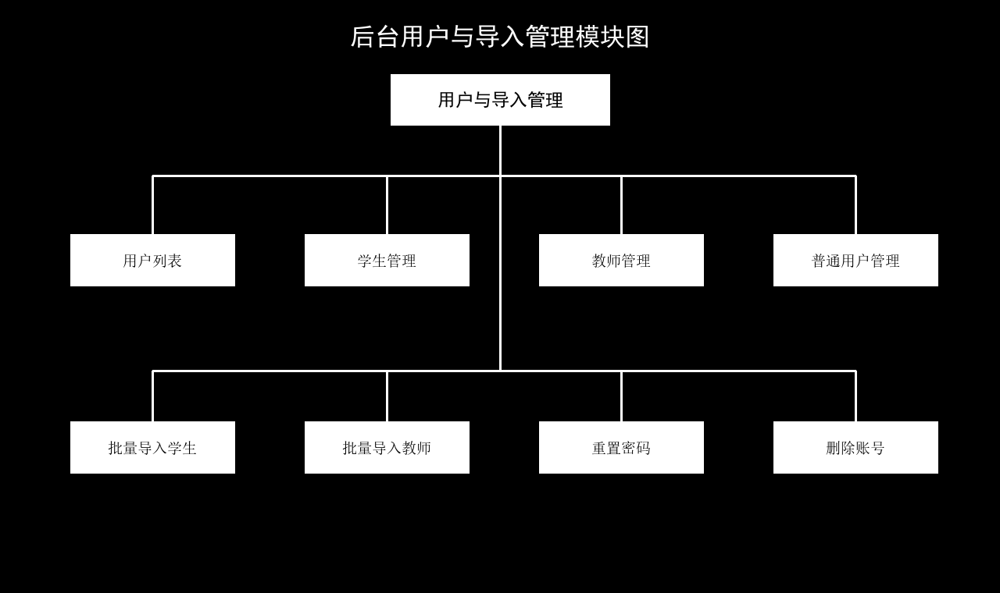

图 4-19 后台用户与导入管理模块图

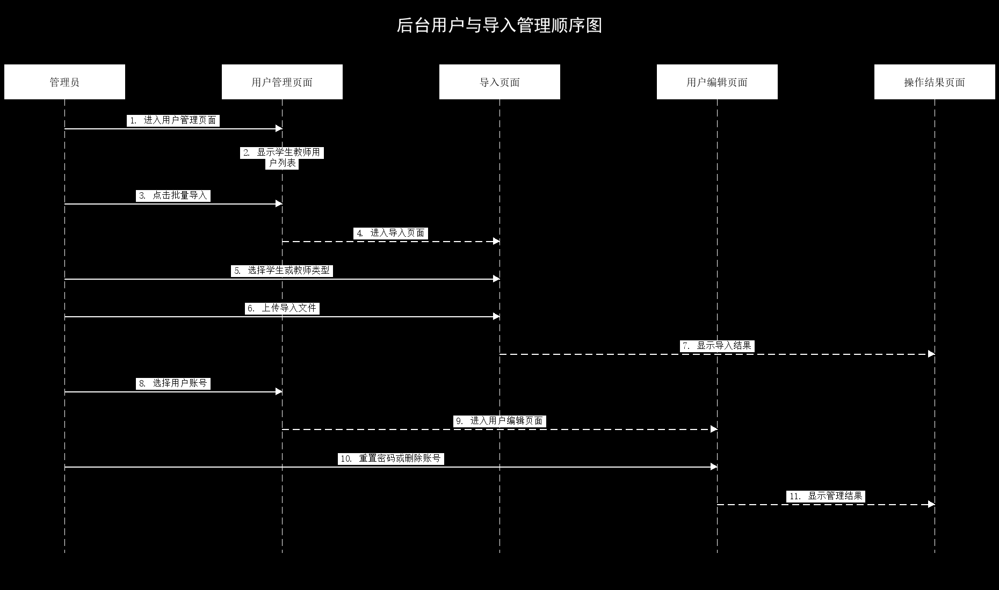

图 4-20 后台用户与导入管理顺序图

## 4.12 后台数据统计与运营管理模块

后台数据统计与运营管理模块用于帮助管理员掌握系统运行情况。管理员可以查看近期借阅记录、座位预约记录、热门收藏图书和评价数据，也可以管理漂流图书信息。系统通过数据看板汇总关键运营数据，并结合 AI 报告生成功能，为图书馆资源维护、座位管理和用户服务优化提供参考。

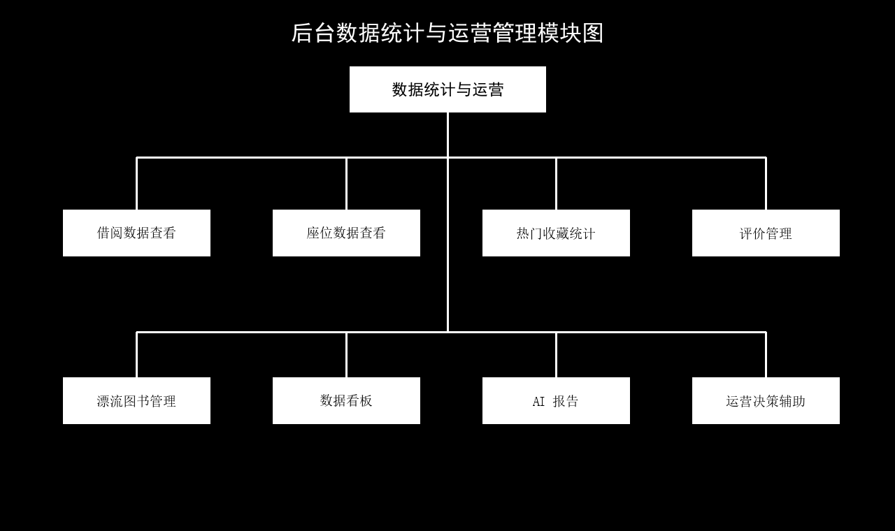

图 4-21 后台数据统计与运营管理模块图

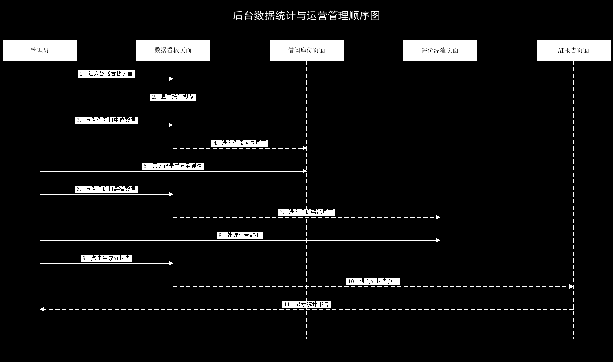

图 4-22 后台数据统计与运营管理顺序图
